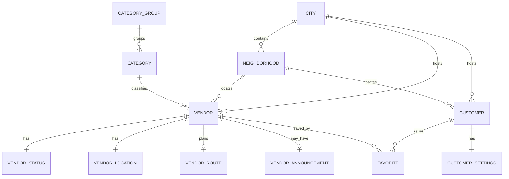

# RediWala Firebase Data Model

Permanent Realtime Database model for Customer + Vendor apps.  
This document explains **entities**, **relationships**, and **query paths**. Schema roots are defined in `FIREBASE_SCHEMA.md`.

---

## Entity relationship diagram



---

## Cities

Supports expansion beyond Chennai without rewriting paths.

| Field | Purpose |
|-------|---------|
| `id` | Stable key (`chennai`) |
| `name` / `state` / `country` | Display + analytics |
| `defaultLanguage` | App bootstrap hint |
| `timezone` | Schedule / “My Day” |
| `enabled` / `pilot` | Rollout flags |

**Query:** `/cities` once at launch; filter `enabled == true`.

---

## Neighborhoods

| Field | Purpose |
|-------|---------|
| `cityId` | Multi-city FK |
| `nameEn` / `nameTa` | Localized labels |
| `mapCenter` / `defaultZoom` | MapKit region |
| `landmarks[]` | Route + pin hints |

**Query:** `/neighborhoods` filtered client-side by `cityId`, or maintain a future index `/city_neighborhoods/{cityId}/{neighborhoodId}: true` if city count grows large.

---

## Categories

`categoryGroups` holds group titles.  
`categories` hold leaf categories with `group`, SF Symbol, `comingSoon`, `displayOrder`.

**Coming soon (not assignable to seeded vendors):** `tailor`, `sofa_repair`.

**Query:** load groups + categories once; cache for home grids.

---

## Vendors (profiles)

Static-ish profile document. Do **not** put live lat/lng here.

Key fields: `displayName`, `businessName`, `categoryId`, `cityId`, `neighborhoodId`, `languages`, `workingHours`, `ratingSummary`, `memberSince`, bilingual descriptions, `verified`, `photoURL`, `phone`.

**Query patterns:**

| Need | Path |
|------|------|
| One vendor | `/vendors/{id}` |
| All pilot vendors | `/vendors` (OK for ~40–few hundred; shard later) |
| By neighborhood (future) | optional index `/neighborhood_vendors/{nId}/{vId}: true` |

---

## Live status & location

Split for write amplification and listener cost:

| Node | Update frequency | Listeners |
|------|------------------|-----------|
| `vendor_status` | Session start/stop | Home cards, detail |
| `vendor_locations` | Frequent while live | Map |

Both keyed by `vendorId` for O(1) join with profile.

---

## Daily routes (`vendor_routes`)

One object per vendor per seed day:

```text
/vendor_routes/{vendorId}/stops/{stopId}
```

Stop: `time`, titles, coordinates, `status ∈ {completed,current,upcoming}`.

Supports Customer “My Day” without nesting under the profile document.

---

## Announcements (`vendor_announcements`)

Metadata only in this foundation sprint:

- `storagePath` placeholder (`announcements/dev/{vendorId}/sample.m4a`)
- bilingual transcripts
- `playbackIntervalMinutes` ∈ {10, 15, 20}

No Storage uploads here. Future Vendor recording writes Storage + updates this node.

---

## Customers, favorites, settings

| Node | Shape |
|------|-------|
| `customers/{id}` | Profile |
| `customer_favorites/{customerId}/{vendorId}` | `true` |
| `customer_settings/{customerId}` | prefs |

### Why favorites are a boolean map

Realtime Database cannot efficiently query “all customers who favorited X” or arbitrary joins. The map under each customer gives:

1. Constant-time “is favorited?”  
2. Simple list of a customer’s favorites  
3. Clean security: write only when `auth.uid == customerId`  

Optional future reverse index for vendor analytics: `/vendor_favorited_by/{vendorId}/{customerId}: true`.

---

## Offline & sync notes

- Prefer observing only `vendor_status` + `vendor_locations` for map screens.  
- Cache `categories`, `neighborhoods`, and vendor profiles more aggressively.  
- Keep announcement audio out of RTDB (Storage + metadata pointer).  

---

## Mapping to iOS (future)

| RTDB | Future Swift |
|------|--------------|
| `vendors` | `Seller` / `Vendor` profile |
| `vendor_status.isLive` | `isLive` |
| `vendor_locations` | Map annotation |
| `vendor_routes` | My Day timeline |
| `customer_favorites` | FavoritesViewModel |

Until integration, iOS continues on `LocalSellerRepository` / `SyntheticChennaiData`.
