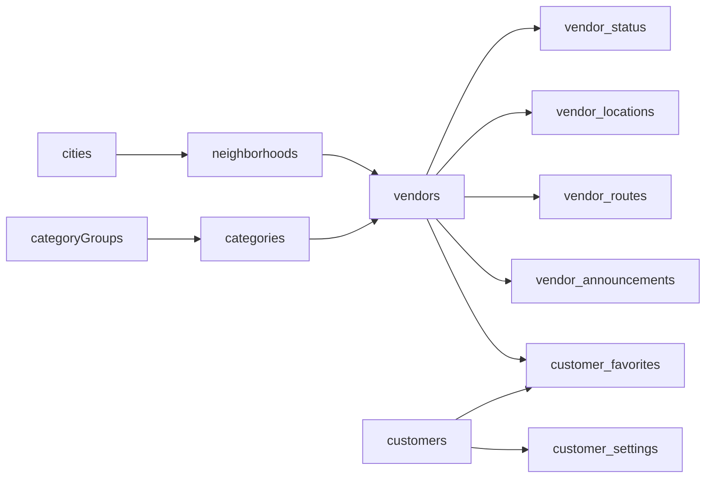

# RediWala Firebase Schema (Permanent v2)

**Project:** `rediwala-development`  
**Database:** Firebase Realtime Database  
**Schema version:** `2.0`  
**Pilot:** Chennai, Tamil Nadu  
**App status:** iOS still uses `LocalSellerRepository` — this schema is prepared, not wired

---

## Design principles

| Principle | How we apply it |
|-----------|-----------------|
| Multi-city ready | `/cities` + `cityId` on neighborhoods/vendors |
| Scale to thousands of vendors | Flat `/vendors/{id}`; no giant nested arrays |
| Real-time live data | Separate `/vendor_status` and `/vendor_locations` |
| Efficient favorites | `/customer_favorites/{customerId}/{vendorId}: true` |
| Bilingual UI | EN + TA fields on catalog entities |
| Offline-friendly | Small documents; clients sync only needed roots |
| Safe evolution | `metadata.schemaVersion`; legacy `seller_*` roots cleared on reset |

Avoid deeply nested trees such as `/cities/chennai/neighborhoods/.../vendors/...` — those force large downloads and make security rules harder.

---

## Root overview

```text
metadata
cities
neighborhoods
categoryGroups
categories
vendors
vendor_status
vendor_locations
vendor_routes
vendor_announcements
customers
customer_favorites
customer_settings
```



---

## Node summaries

### `metadata`
`schemaVersion`, `generatedAt`, `environment`, `pilotCity`, `pilotCityId`, `pilotNeighborhoods`, `seedTag`

### `cities/{cityId}`
`id`, `name`, `state`, `country`, `defaultLanguage`, `timezone`, `enabled`, `pilot`  
Seeded: Chennai (pilot) + disabled shells for Bangalore, Hyderabad, Mumbai.

### `neighborhoods/{neighborhoodId}`
`id`, `cityId`, `nameEn`, `nameTa`, `mapCenter`, `defaultZoom`, `landmarks[]`  
Pilot: `t_nagar`, `west_mambalam`, `thiruvanmiyur`.

### `categoryGroups/{groupId}` + `categories/{categoryId}`
Groups: Fresh & Daily, Neighborhood Services, Recycling, Street Treats.  
Categories include `comingSoon` for `tailor` and `sofa_repair`.

### `vendors/{vendorId}`
Profile fields: `displayName`, `businessName`, `categoryId`, `cityId`, `neighborhoodId`, languages, hours, ratings, bilingual descriptions, `verified`, `photoURL`, `phone` (null placeholders).

### High-churn companion nodes
- `vendor_status` — `isLive`, `lastSeen`, availability text  
- `vendor_locations` — lat/lng, heading, speed, accuracy, landmark  
- `vendor_routes` — morning stops with `completed|current|upcoming`  
- `vendor_announcements` — metadata only (no audio bytes)

### Customers
- `customers` — synthetic profiles  
- `customer_favorites/{customerId}/{vendorId}: true`  
- `customer_settings` — language / notification preferences  

---

## ID conventions

| Entity | Pattern |
|--------|---------|
| City | `chennai` |
| Neighborhood | `t_nagar` |
| Category | `knife_sharpening` |
| Vendor | `vendor_001` … |
| Customer | `customer_001` … |
| Route stop | `stop_01` … |

---

## Security (proposed, not auto-deployed)

See `firebase/database.rules.json`:

- Default deny  
- Authenticated read for catalog + public vendor pilot data  
- Customer private nodes readable only when `auth.uid == customerId`  
- No public writes in this phase  

Future Auth will unlock scoped vendor location publishes and customer favorite writes.

---

## Related docs

- `docs/FIREBASE_DATA_MODEL.md` — field-level model & query patterns  
- `docs/FIREBASE_SEEDING.md` — how to seed/validate/reset  
- `docs/FIREBASE_DATA_INSPECTION.md` — console inspection  
- `docs/BASELINE_LOCAL_DATA.md` — current iOS local baseline  
